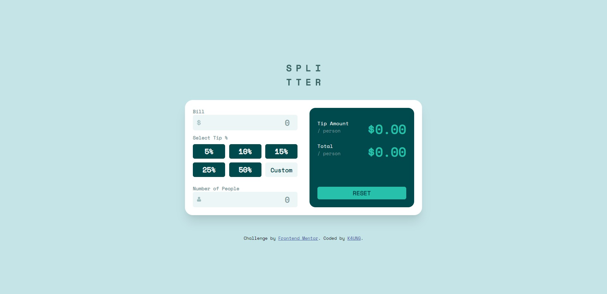
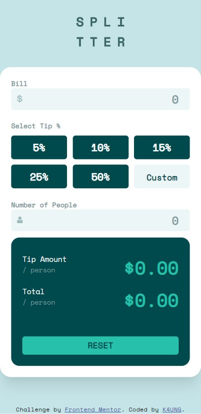

# Frontend Mentor - Tip calculator app solution

This is a solution to the [Tip calculator app challenge on Frontend Mentor](https://www.frontendmentor.io/challenges/tip-calculator-app-ugJNGbJUX). Frontend Mentor challenges help you improve your coding skills by building realistic projects.

## Table of contents

- [Overview](#overview)
  - [The challenge](#the-challenge)
  - [Screenshot](#screenshot)
  - [Links](#links)
- [My process](#my-process)
  - [Built with](#built-with)
  - [What I learned](#what-i-learned)
  - [Continued development](#continued-development)
  - [Useful resources](#useful-resources)

**Note: Delete this note and update the table of contents based on what sections you keep.**

## Overview

### The challenge

Users should be able to:

- View the optimal layout for the app depending on their device's screen size
- See hover states for all interactive elements on the page
- Calculate the correct tip and total cost of the bill per person

### Screenshot

### Links

- Solution URL: [Solution URL](https://github.com/K4UNG/project3-tip-calculator)
- Live Site URL: [Live URL](https://k4ung3.netlify.app)

## My process

### Built with

- Semantic HTML5 markup
- CSS custom properties
- Flexbox
- CSS Grid
- JavaScript

### What I learned

This is my first project where I use JavaScript so things that I didn't know are just keep coming out and I learned a lot about DOM manipulation.

### Continued development

I will learn more JavaScript as I now know what my level is along with CSS.

### Useful resources

- [W3Schools](https://www.w3schools.com/) - This website has been really helpful along my web programming journey. It's almost like a wiki for web development.
- [StackOverFlow](https://stackoverflow.com/) - Whenever I want to do something but I don't know how, I always end up here. It's a life-saver for pretty much all of my projects that include coding.